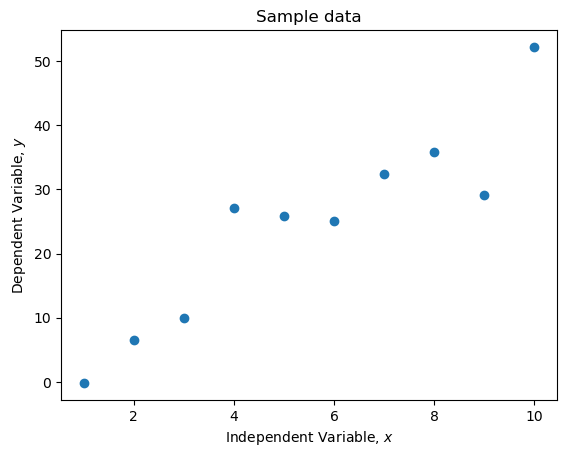
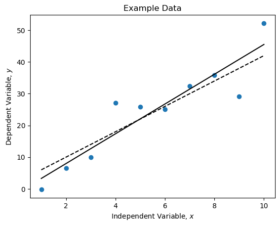
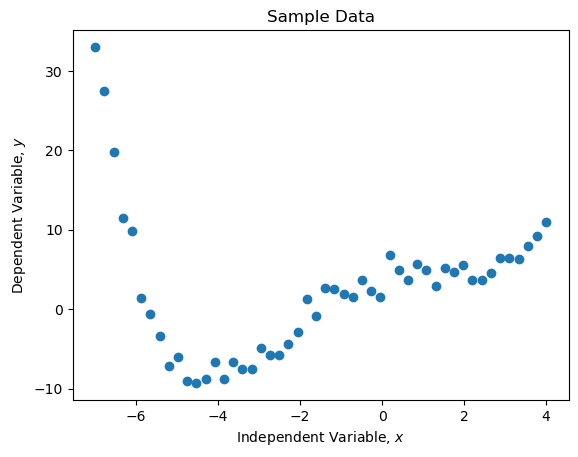
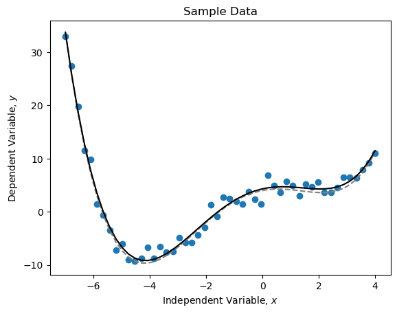

In an effort to reduce the number of concepts my students need to learn in Physical Chemistry lab, I'm trying to cut down the number of Python methods I introduce to them. One of the places where there are _many_ options is in the realm of curve fitting. For a simple linear fit, just SciPy and NumPy offer at least three separate options:

- NumPy offers the [`Polynomial.fit()`][np-poly] method (which replaces the old `polyfit()` method often found in tutorials). This is a fast, flexible way to work with polynomial functions and fits, but I find the distinction between "domain" and "window" for the functions to be _far_ too confusing to want to discuss with students. 
- SciPy offers the [`linregress()`][sp-linreg] function inside the `stats` module. This is probably the easiest method to introduce to students, as it's a simple linear regression and returns the same statistics students have seen in Excel fits (including the statistics returned with the [`LINEST`][excel-linest] function). 
- SciPy also offers the [`curve_fit()`][sp-curve_fit] function in the `optimize` module, a powerful routine that performs curve-fitting on arbitrarily defined functions. It's capable of returning simple fit parameters as well as complete statistics. It can also take in weights for the individual data points, useful for large datasets where this information is available. 

[np-poly]:      https://numpy.org/doc/stable/reference/routines.polynomials.html
[sp-linreg]:    https://docs.scipy.org/doc/scipy/reference/generated/scipy.stats.linregress.html#scipy.stats.linregress
[excel-linest]: https://support.microsoft.com/en-us/office/linest-function-84d7d0d9-6e50-4101-977a-fa7abf772b6d
[sp-curve_fit]: https://docs.scipy.org/doc/scipy/reference/generated/scipy.optimize.curve_fit.html

Again, my motivation is to reduce the mental overhead in learning to fit data with Python. If the only data students ever worked with was linear (and it _is_ possible to transform almost all their data into linear models), the `linregress()` function would probably be the best choice. Unfortunately, it's limited to linear fits and so can't be used for higher order polynomials or non-linear functions (exponential, log, and sigmoidal functions frequently appear in chemistry). 

This leaves me leaning toward using `curve_fit()`, but I wanted to know what the cost to defaulting to this function might be. Below is my simple comparison of the three methods on a linear fit and then a comparison of `Polynomial.fit()` and `curve_fit()` on a higher-order polynomial. The contents of my Jupyter notebook are shown below. 

## Curve fit algorithm comparison

Create and plot some data. 


```python
import numpy as np

# Nice to set a seed for the random number generator,
# this produces the same "random" numbers each time. 
np.random.seed(2342)

# Create an array of x values
x = np.arange(1, 11)
# Produce y values from a model line
m = 4
b = 2
y = m*x + b
# Add random variations to our signal
ys = y + np.random.normal(scale=np.sqrt(np.mean(y)), size=len(x))  


# Create a plot
plt.plot(x, ys, 'o')
plt.title('Sample data')
plt.xlabel('Independent Variable, $x$')
plt.ylabel('Dependent Variable, $y$')
plt.show()
```


    

    


### Method 1: `scipy.stats.linregress`


```python
from scipy import stats

reg = stats.linregress(x, ys)

# Line of best fit
reg_ys = reg.slope * x + reg.intercept
# Associated error
reg_error = ys - reg_ys
deg_of_freedom = len(x) - 2
res_std_err = np.sqrt(np.sum(reg_error**2) / deg_of_freedom)

print(*reg[:2])

# Create a plot
plt.plot(x, ys, 'o', label='Raw data')
plt.plot(x, m * xlim + b, 'k--', label='True underlying relationship')
plt.plot(x, reg.slope * xlim + reg.intercept, 'k', label='Line of best fit')
plt.title('Example Data')
plt.xlabel(r'Independent Variable, $x$')
plt.ylabel(r'Dependent Variable, $y$')
plt.show()
```

Output: `4.693247667996253 -1.4115640583981168`


    

    


### Fit using `Polynomial.fit` from NumPy


```python
from numpy.polynomial.polynomial import Polynomial

p = Polynomial.fit(x, ys, 1, window=(1,10))
print(*p.coef[::-1])

# Create a plot
plt.plot(x, ys, 'o', label='Raw data')
plt.plot(x, m * x + b, 'k--', label='True underlying relationship')
plt.plot(x, p(x), 'k', label='Line of best fit')
plt.title('Example Data')
plt.xlabel(r'Independent Variable, $x$')
plt.ylabel(r'Dependent Variable, $y$')
plt.show()
```

Output: `4.6932476679962525 -1.411564058398124`


    

    


### Fit using `sp.curve_fit`


```python
from scipy.optimize import curve_fit

def lin_func(x, m, b):
    return m*x + b

popt, pcov = curve_fit(lin_func, x, ys)
print(*popt)

# Create a plot
plt.plot(x, ys, 'o', label='Raw data')
plt.plot(x, m * x + b, 'k--', label='True underlying relationship')
plt.plot(x, lin_func(x, *popt), 'k', label='Line of best fit')
plt.title('Example Data')
plt.xlabel(r'Independent Variable, $x$')
plt.ylabel(r'Dependent Variable, $y$')
plt.show()
```

Output: `4.693247668004307 -1.4115640584033717`


    

    


### Compare the time of the three methods


```python
%%timeit
reg = stats.linregress(x, ys)
```

Result: 55.1 µs ± 274 ns per loop (mean ± std. dev. of 7 runs, 10,000 loops each)


```python
%%timeit
# Fit a polynomial of degree 1 (a linear function) to the data
p = np.polyfit(x, ys, 1)
```

Result: 33.4 µs ± 361 ns per loop (mean ± std. dev. of 7 runs, 10,000 loops each)


```python
%%timeit
# Fit the function m * t + c to x and y
popt, pcov = curve_fit(lin_func, x, y)
```

Result: 124 µs ± 932 ns per loop (mean ± std. dev. of 7 runs, 10,000 loops each)


```python
n = 11
print(*np.round(reg[:2],n))
print(*np.round(p.coef[::-1],n))
print(*np.round(popt,n))
del(n)
```

Comparison of fit results:

    4.693247668 -1.4115640584
    4.693247668 -1.4115640584
    4.693247668 -1.4115640584


## Something a bit more complicated: a 5th-degree polynomial


```python
from numpy.polynomial.polynomial import Polynomial

# Generate some more x points
x = np.linspace(-7,4)

# Make a new set of y values
p5 = Polynomial([4,1,-1,0.1,0.05])

y = p5(x)
y = y + np.random.normal(scale=np.sqrt(np.mean(y)), size=len(x))  # Add noise

# Create a plot
plt.plot(x, y, 'o')
plt.title('Sample Data')
plt.xlabel(r'Independent Variable, $x$')
plt.ylabel(r'Dependent Variable, $y$')
plt.show()
```


    

    


```python
p = Polynomial.fit(x, y, 4, window=(-7,4))

# Create a plot
plt.plot(x, y, 'o', label='Raw data')
plt.plot(x, p5(x), '--', c='grey', label='True model')
plt.plot(x, p(x), 'k-', label='Curve of best fit')
plt.title('Sample data')
plt.xlabel(r'Independent Variable, $x$')
plt.ylabel(r'Dependent Variable, $y$')
plt.show()
```


    

    


```python
def p5_func(x, a, b, c, d, e):
    return a + b*x + c*x**2 + d*x**3 + e*x**4

popt, pcov = curve_fit(p5_func, x, y)

# Create a plot
plt.plot(x, y, 'o', label='Raw data')
plt.plot(x, p5(x), '--', c='grey', label='True model')
plt.plot(x, p5_func(x, *popt), 'k', label='Curve of best fit')
plt.title('Sample Data')
plt.xlabel(r'Independent Variable, $x$')
plt.ylabel(r'Dependent Variable, $y$')
plt.show()
```


    

    


```python
%%timeit
# Fit a polynomial of degree 5 to the data
p = Polynomial.fit(x, y, 4, window=(-7,4))
```

Result: 102 µs ± 297 ns per loop (mean ± std. dev. of 7 runs, 10,000 loops each)


```python
%%timeit
popt, pcov = curve_fit(p5_func, x, y)
```

Result: 301 µs ± 2.63 µs per loop (mean ± std. dev. of 7 runs, 1,000 loops each)


```python
n = 6
print(np.round(p.coef,n))
print(np.round(popt, n))
del(n)
```

Comparison of fit results:

    [ 4.305776  1.177208 -0.960277  0.087459  0.047794]
    [ 4.305776  1.177208 -0.960277  0.087459  0.047794]

